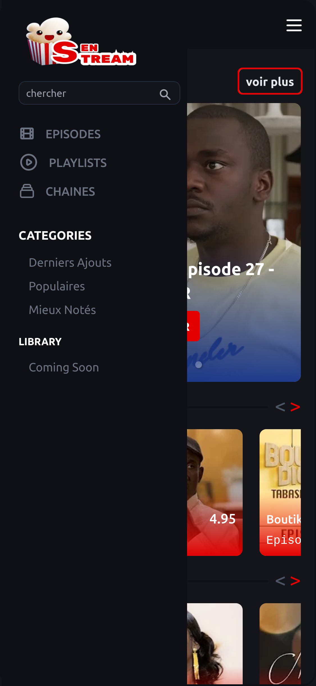
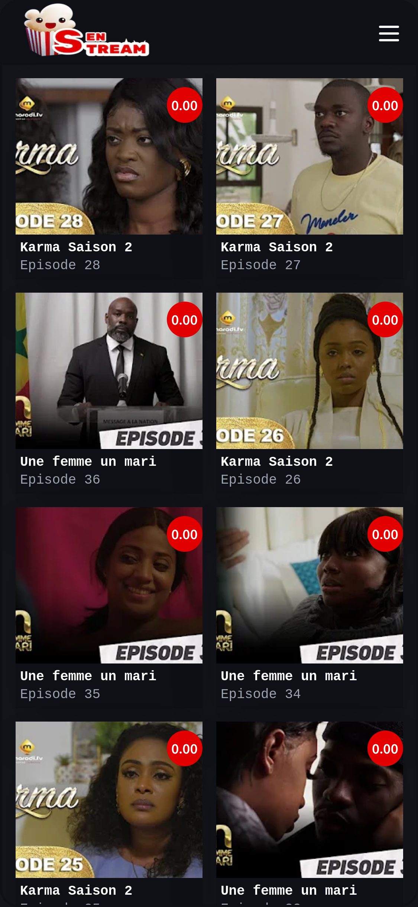
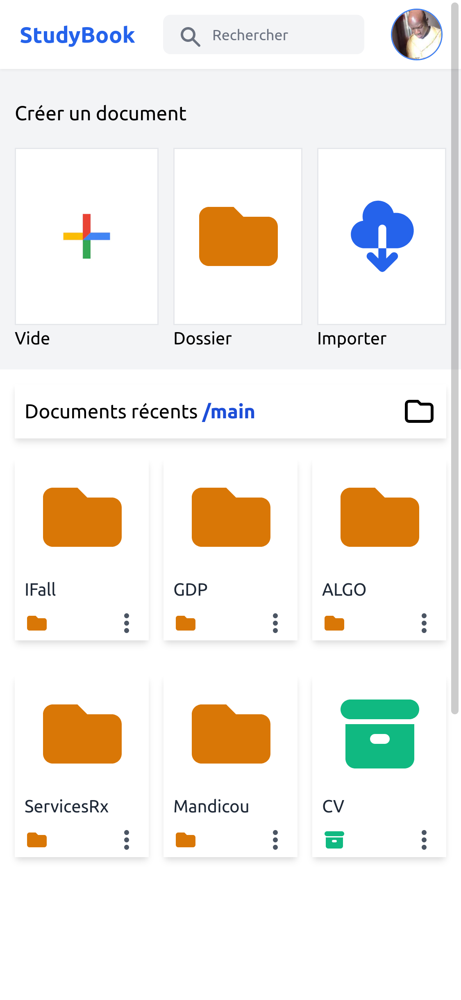
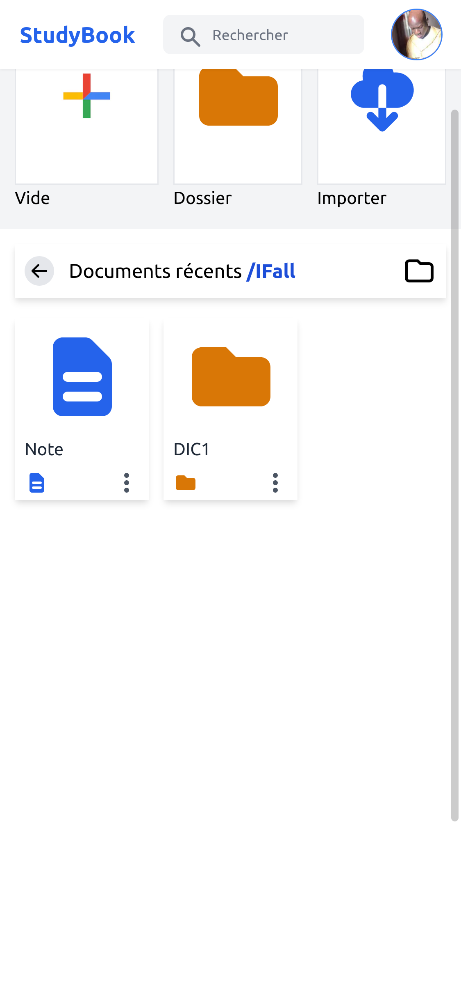
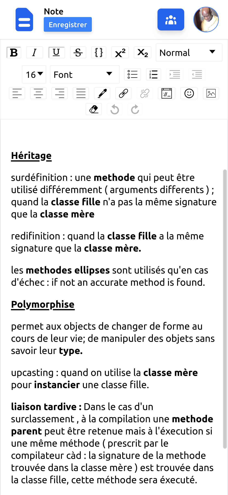

### Hi there 👋 i'm
## **Alioune Sall**

### Description
> Baaah... i'm a :<br/>
>> geek; I love coding and learning new stuff<br/>
>> computer science student at ESP ( ECOLE SUPERIEURE POLYTECHNIQUE DE DAKAR )<br/>
>> python lover, but have crush on Javascript and it's babies :)<br/>
>> Full-Stack developper.

### Skills ?
<details>
  <summary>click to expand</summary>
  
```python
  class Skills:
    def __init__(self):
      self._frontend = ['react', 'nextjs', 'vuejs', 'react-native']
      self._backend = ['python', 'flask', 'django', 'nodejs', 'javascript']
      self._other = ['git', 'web scraping', 'mongodb', 'automation']
      
    def addFront(self, skill):
      self._frontend.append(skill)
      
    def addBack(self, skill):
      self._backend.append(skill)
      
    def addOther(self, skill):
      self._other.append(skill)
      
    def __str__(self):
      return f" FrondEnd : {self._frontend}\n Backend : {self._backend}\n Other : {self._other} "
      
 skills = Skills()
 print(skills)
```
</details>

### Some Projects ?

<details>
  <summary>click to expand</summary>

 * #### SenStream
  > Regarder les Series Sénégalaise sans publicité

<table border="0">
  <tr>
    <td></td>
    <td></td>
    <td></td>
    <td></td>
  </tr>
</table>

 * #### StudyBook
  > Impossible de gérer vos notes de cours ? <br/>
  > Ayez votre propre gestionnaire, votre drive personnel et rangez vos documents comme vous voulez

<table border="0">
  <tr>
    <td></td>
    <td></td>
    <td></td>
  </tr>
</table>

#### And many other projects
  
</details>


- 🔭 I’m currently working on some personnal projects but can do part time 
- ⚡ Fun fact: ??????    :)
